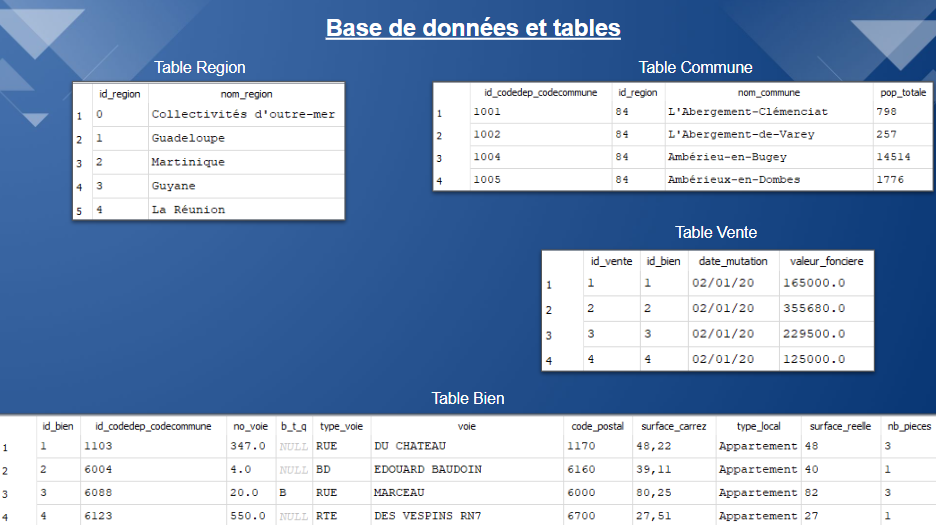

# Analyse du marché immobilier français

## 🎯 Objectif du projet

Ce projet consiste à créer et exploiter une base de données relationnelle afin d’analyser le marché immobilier français.

L’objectif principal était de structurer plusieurs jeux de données immobilières et de répondre à différentes problématiques métiers grâce à des requêtes SQL.

---

## 🧱 Données utilisées

Le projet repose sur plusieurs fichiers CSV contenant :

- les ventes immobilières
- les biens
- les communes
- les régions

Ces données ont été intégrées dans une base relationnelle SQLite.

---

## 📊 Analyses réalisées

Les analyses ont permis d’étudier :

- les prix immobiliers
- les volumes de ventes
- les types de biens
- les différences géographiques entre régions et communes

Les résultats ont été obtenus à l’aide de requêtes SQL adaptées aux besoins métiers.

---

## 🛠️ Technologies utilisées

- SQL
- SQLite
- Excel

---

## 🔐 Gestion et qualité des données

Une attention particulière a été portée à :

- la cohérence des données
- la gestion des clés primaires et étrangères
- la fiabilité des résultats
- le respect des principes RGPD

  

---

## 📌 Conclusion

Ce projet m’a permis de développer mes compétences en modélisation de bases de données relationnelles, en manipulation SQL et en analyse de données immobilières.

---

## 📷 Aperçu des tables

